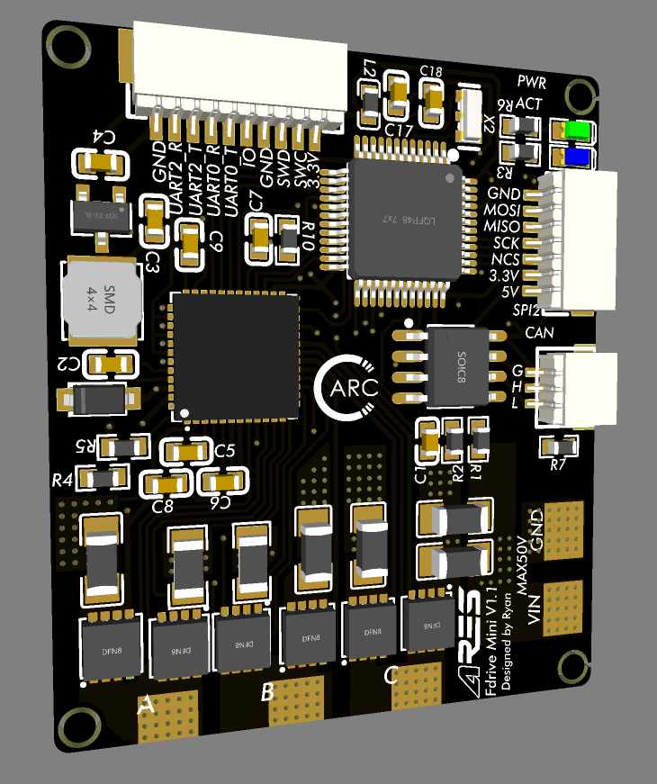

# !!! Hardware Designed, But NOT Tested and Validated !!!
# !!! 本硬件仅完成设计，未进行验证与测试，不保证性能与安全 !!!

# Fdrive BLDC Controller
Brushless DC Motor Controller features small size, high voltage, and precise control.

****
## Fdrive Mini V1.1:

 Fdrive Mini V1.1 is originated from another BLDC controller project DGM: [DGM Repository](https://github.com/codenocold/dgm). Same schematic, similar layout. Therefore, firmware is compatible with DGM V1.3.

# Fdrive 无刷电机控制器
Fdrive 是一款小尺寸、支持高电压、精准的FOC驱动器。

## Fdrive Mini V1.1:

 Fdrive Mini V1.1 是基于DGM V1.3 无刷电机控制器的一款34mm×40mm微型无刷电机控制器。[DGM 开源仓库](https://github.com/codenocold/dgm). 与DGM V1.3具有同样的原理图，所以兼容DGM V1.3的固件与配套软件。
